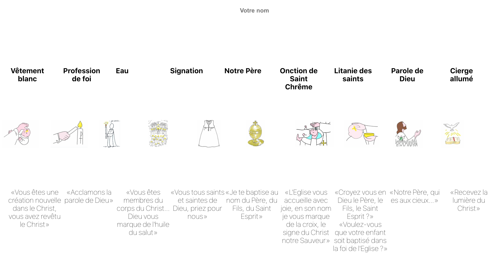
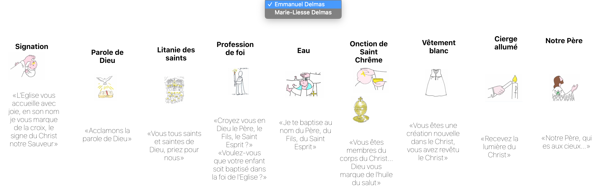

# Baptismal Liturgy

Reorder catholic baptismal liturgy steps and associate title, image and quote.



I created this game during the lockdown in order to adpat our baptismal preparation to a remote meeting.

## Description

This game display a board with titles, images and quotes from the catholic baptismal liturgy.
These elements should be dragged and dropped on the board to be displayed in the good order.
All positions changes are synchronized for all users and available from the admin board.
The admin can select the user of its choice and see its board in realtime.

User board and admin board are responsive. Movements on the user board will be reflected on the admin board in proportion to the size of its window.



## Developer

I'm a ruby developer and it is my first experience with [React JS](https://github.com/facebook/create-react-app) and with firebase database.
Firebase is a very nice library and an easy to use infrastructure. Google provide all you need for local testing.
I learnt the lifecycle of React component and how to build SPA.

### Available Scripts

```
npm run build
npm run start # to execute firebase start
npm run deploy # to execute firebase deploy
```
